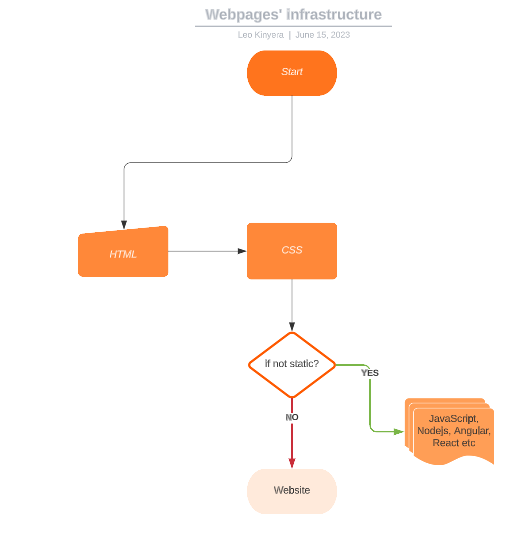

  # HTML_projects

# Bricks-and-Sand  
Build websites ground up. Inspired by how a frame of a building is put up and that's ofcourse the fundamental role of <i>HTML.</i>

   * In this project, I shall be using HTML to come up with basic structures of various websites as I wait for the time I shall actually learn this in ALX.
   * Meanwhile, the project is open-sourced under an MIT License and I welcome any contributors to it. Happy contributing.

    

